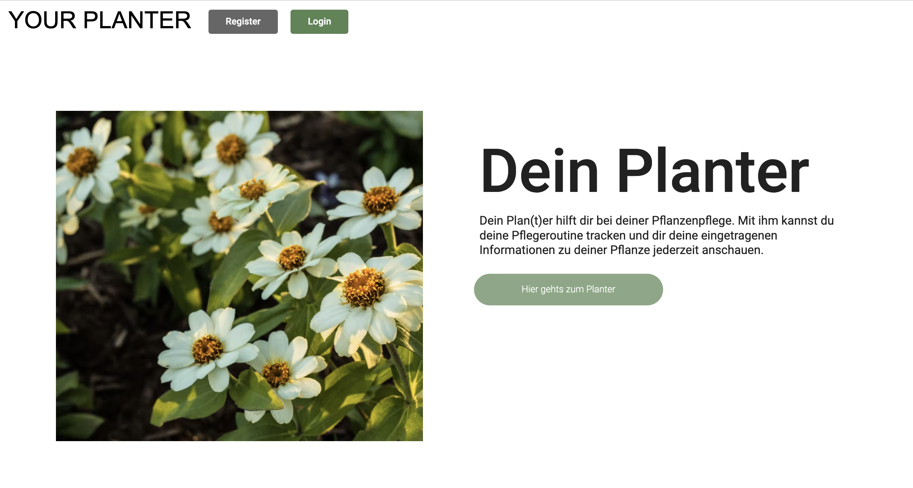
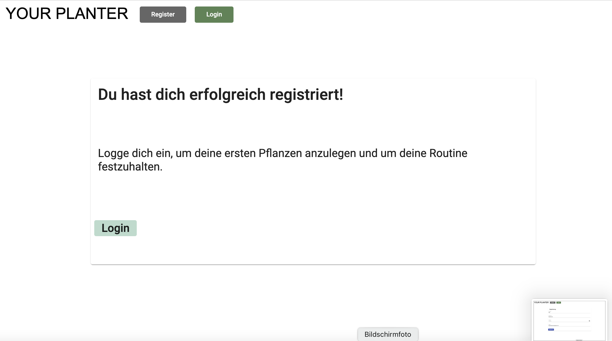
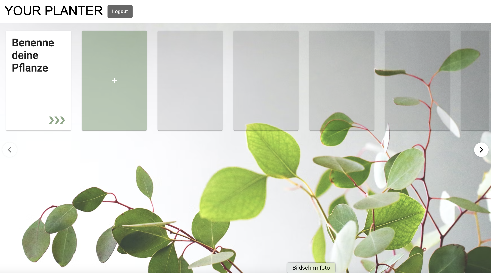
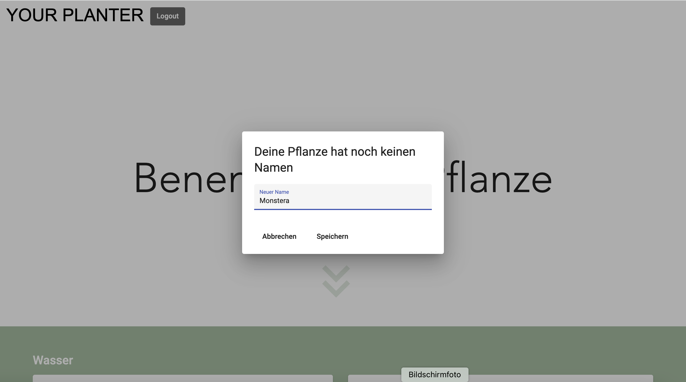
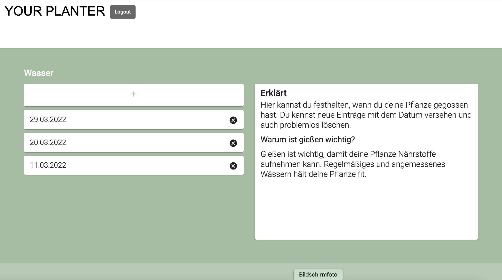
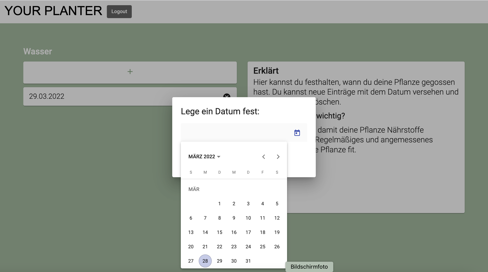
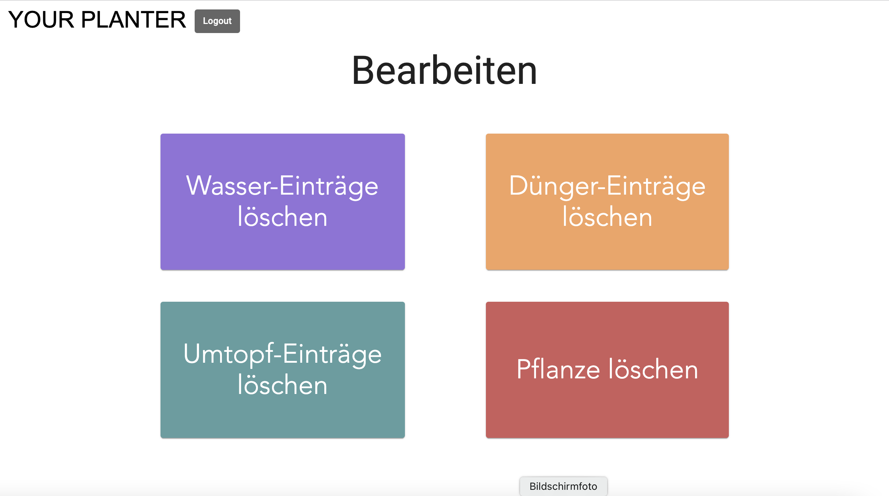
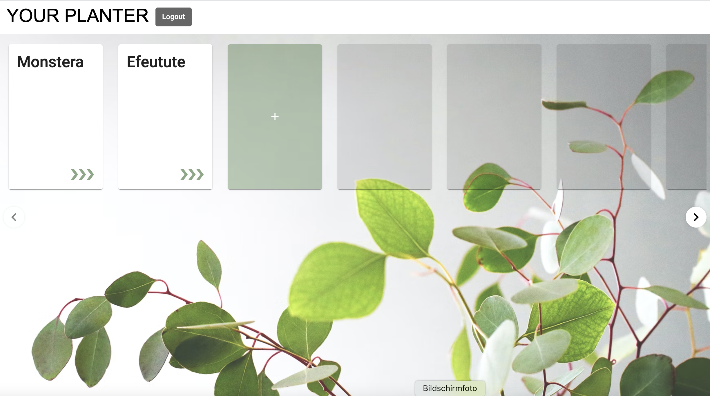

# Gliederung

1. YOUR PLANTER
   1. Registrierung und Login
   2. Komponente "Plan(t)er"
   3. Komponente „Pflanze“
2. Run the Project
   1. Frontend
      1. Development server
      2. Code scaffolding
      3. Build
      4. Running unit tests
      5. Running end-to-end tests
      6. Further help
   2. Backend

# YOUR PLANTER

YOUR PLANTER dient dazu die Pflegeroutine deiner Pflanzen festzuhalten.
Es geht darum, dass du für jede von dir angelegte Pflanze Daten eintragen kannst, an denen du sie gewässert, gedüngt oder umgetopft hast. So verlierst du nicht den Überblick.

## Registrierung und Login
Du kannst dich registrieren und einloggen, um deinen eigenen Planter zu erhalten. So werden deine Daten immer gespeichert.

## Komponente „Plan(t)er“

Wenn du eingeloggt bist, wirst du auf deine Planter-Seite geleitet.
Dort kannst du eine neue Karte erstellen, indem du auf die Karte mit dem Plus drückst.
Es erscheint eine neue Karte, die du nun umbenennen solltest. Die Pfeile rechts unten auf der Karte „Benenne deine Pflanze“ leiten dich auf die Vollansicht deiner neuen Karte weiter.

## Komponente „Pflanze“

Wenn du nun auf den Namen „Benenne deine Pflanze“ klickst, erscheint ein Dialogfenster, worin du deinen Pflanzennamen festlegen kannst.
Mit dem Klick auf "Speichern" hast du nun deine erste Pflanze benannt.

Wenn du weiter nach unten scrollst, siehst du drei Kategorien: Wasser, Dünger und Umtopfen.
Hier kannst du deine Routine einsehen, festhalten und löschen (mit dem X-Icon).

Wenn du nun auf die kleine Karte mit dem Plus drückst, dann erscheint ein Dialogfenster, in dem du ein Datum für deine Wässerung auswählen und speichern kannst.
Das Gleiche auch für Dünger und Umtopfen.

Ganz unten auf der Seite findest du vier Button. Die Button „Wasser-Einträge löschen“, „Dünger-Einträge löschen“ und „Umtopf-Einträge löschen“ dienen dazu jeweils ALLE Einträge dieser Kategorie auf einmal zu löschen.
Mit dem Klick auf den Button „Pflanze löschen“ erscheint ein Dialogfenster, dass dich warnt. Wenn du dieses bestätigst, dann wird deine pflanze mit allen Einträgen gelöscht und du wirst auf die Planter-Komponente geleitet.

Noch einmal zur Übersicht:

Wenn du dich nun ausloggst, wirst du auf die Startseite geleitet.

# Run the Project

At first run `npm install` in the Project directory.

## Frontend

This project was generated with [Angular CLI](https://github.com/angular/angular-cli) version 13.0.3.

### Development server

Run `ng serve` for a dev server. Navigate to `http://localhost:4200/`. The app will automatically reload if you change any of the source files.

### Code scaffolding

Run `ng generate component component-name` to generate a new component. You can also use `ng generate directive|pipe|service|class|guard|interface|enum|module`.

### Build

Run `ng build` to build the project. The build artifacts will be stored in the `dist/` directory.

### Running unit tests

Run `ng test` to execute the unit tests via [Karma](https://karma-runner.github.io).

### Running end-to-end tests

Run `ng e2e` to execute the end-to-end tests via a platform of your choice. To use this command, you need to first add a package that implements end-to-end testing capabilities.

### Further help

To get more help on the Angular CLI use `ng help` or go check out the [Angular CLI Overview and Command Reference](https://angular.io/cli) page.

## Backend

Run `npm run watch` in the Backend directory. The backend will automatically reload if you change any of the source files.

